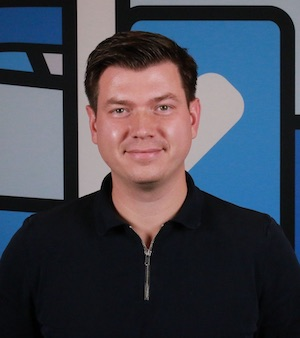

# About me
Hi! My name is Oleksii ([prononciation](./oleksii.m4a)). I'm a Ukrainian-born, Dutch software engineer.

My expertise lies in system engineering, architecture and engineering management.

During my career I worked for Mendix, adidas, Playtika, a couple of agencies, and a few independent assignments in web development since 2005.

[Here](https://docs.google.com/document/d/1RuBtL7zC8sYUCUrDFwRtMSBBG8Qx21v27SDtXDhzE-Q/view) you can find my latest resume.

# Expertise
- Cloud infrastructure;
- Data engineering: storage, streeming, multi-region replication;
- Automation (CI/CD);
- Site reliability;
- System architecture.

# Contacts
For business contacts, please consider connecting with me on [LinkedIN](https://www.linkedin.com/in/nekgasov/)

Email: [my first name] @ [my second name] .nl

KVK number: 84487046
