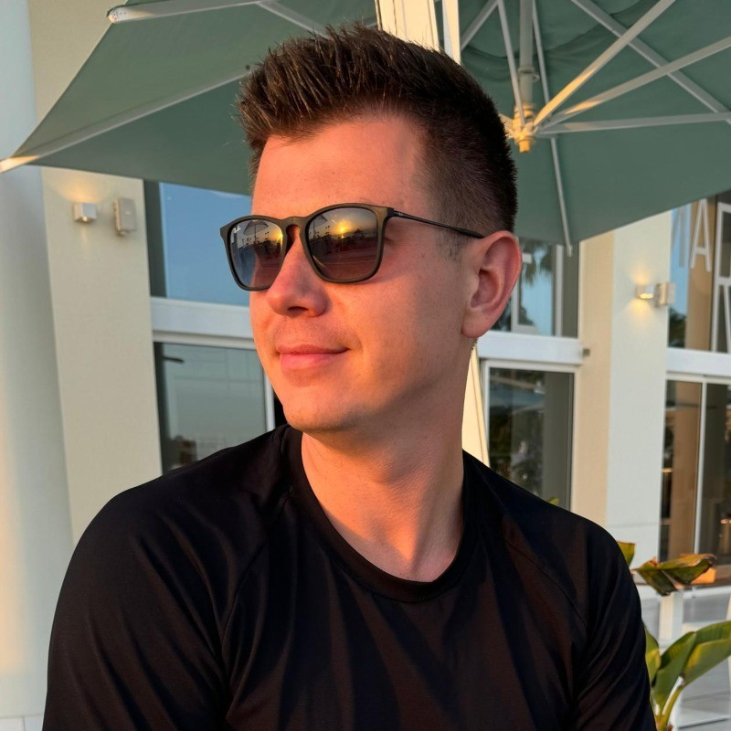

# About me
Hi! My name is Oleksii ([prononciation](./oleksii.m4a)) or simply - Alex (as most of people call me). I'm a Ukrainian-born, Dutch software engineer.

My mission is to help clients to develop secure, cost-efficient, scalable, sustainable and reliable IT projects.

# Expertise
During my career I worked for Nike, Siemens, adidas, Playtika, a couple of agencies, and a few independent assignments in web development since 2005.

Co-founded outdoor sports company in Ukraine and currently, together with my friend, building an online platform for tennis players.

# Services
- Technical leadership: team hiring & coaching, system architecture, technical roadmap;
- Site reliability, cloud infrastructure, devOps, automation (CI/CD), infrastructure monitoring;
- Back-end development;

# Contacts
For business contacts, please consider connecting with me on [LinkedIN](https://www.linkedin.com/in/onekgasov/)

Email: [first name] @ [last name] .nl

KVK number: 84487046
<iframe height='160' width='300' frameborder='0' allowtransparency='true' scrolling='no' src='https://www.strava.com/athletes/20846910/activity-summary/47aee6086f1bd5e3ef2046f5a0406d49719dcbc8'></iframe>
