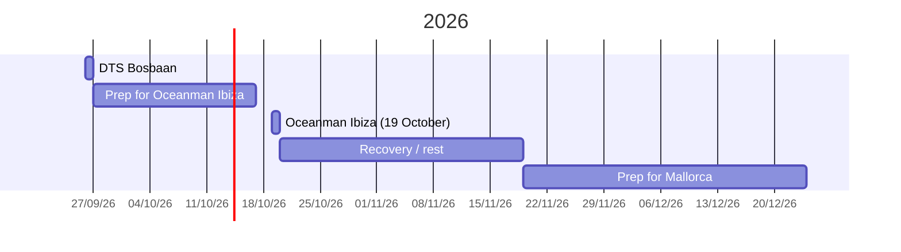
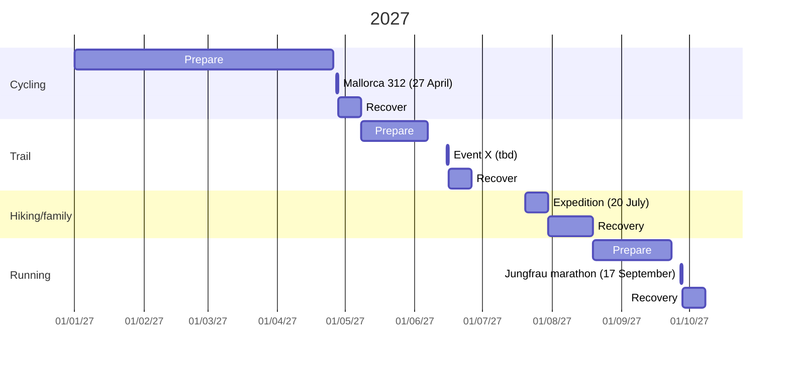

# Events planning

updated: 27 September 2026

```mermaid
gantt
    title 2026
    dateFormat DD-MM-YY
    axisFormat %d/%m/%y
    DTS Bosbaan: a1, 26-09-26, 1d
    Prep for Oceanman Ibiza: a2, after a1, 20d
    Oceanman Ibiza (19 October): a3, 19-10-26, 1d
    Recovery / rest: r1, after a3, 30d
    Prep for Mallorca: after r1, 35d
```

```mermaid
gantt
    title 2027
    dateFormat DD-MM-YY
    axisFormat %d/%m/%y
    section Cycling
    Prepare: b1, 01-01-27, 115d
    Mallorca 312 (27 April): m312, 27-04-27, 1d
    Recover: m312r, after m312, 10d
    section Trail
    Prepare: after m312r, 30d
    Event X (tbd): ex, 15-06-27, 1d
    Recover: after ex, 10d
    section Hiking/family
    Expedition (20 July): e1, 20-07-27, 10d
    Recovery: r2, after e1, 20d
    section Running
    Prepare: after r2, 35d
    Jungfrau marathon (17 September): jm, 27-09-27, 1d
    Recovery: after jm, 10d
```
