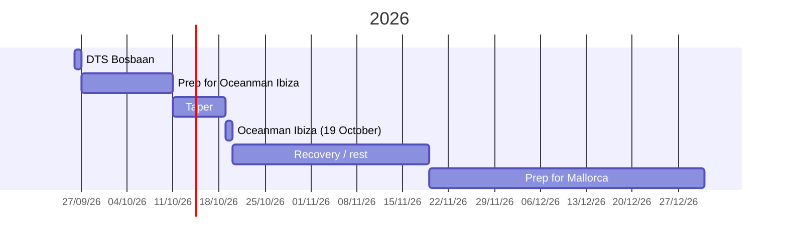
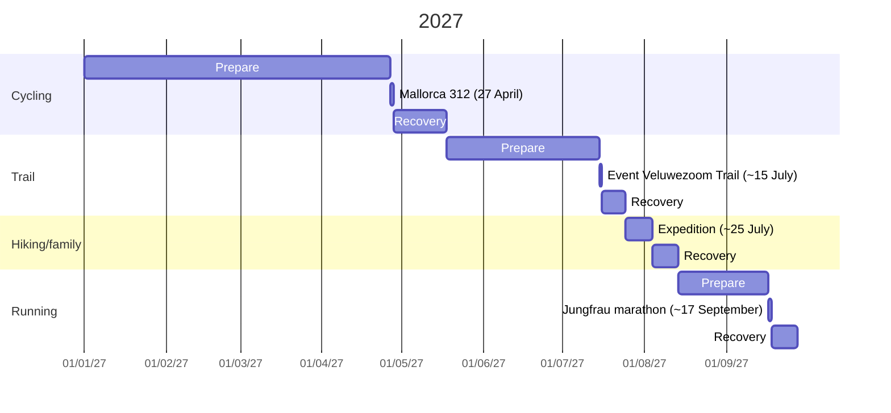

# Events planning

updated: 28 September 2026

```mermaid
gantt
    title 2026
    dateFormat DD-MM-YY
    axisFormat %d/%m/%y

    DTS Bosbaan: a1, 26-09-26, 1d
    Prep for Oceanman Ibiza: a2, after a1, 14d
    Taper: after a2, 8d
    Oceanman Ibiza (19 October): a3, 19-10-26, 1d

    Recovery / rest: r1, after a3, 30d
    Prep for Mallorca: after r1, 31-12-26
```

```mermaid
gantt
    title 2027
    dateFormat DD-MM-YY
    axisFormat %d/%m/%y
    
    section Cycling
    Prepare: b1, 01-01-27, 27-04-27
    Mallorca 312 (27 April): m312, 27-04-27, 1d
    Recovery: m312r, after m312, 20d
    
    section Trail
    Prepare: after m312r, 15-07-27
    Event Veluwezoom Trail (~15 July): vz, 15-07-27, 1d
    Recovery: after vz, 25-07-27
    
    section Hiking/family
    Expedition (~25 July): e1, 25-07-27, 10d
    Recovery: r2, after e1, 10d
    
    section Running
    Prepare: after r2, 17-09-27
    Jungfrau marathon (~17 September): jm, 17-09-27, 1d
    Recovery: after jm, 10d
```
